# SDK Comparison & Selection Guide

Choose the optimal Saros SDK for your project with this comprehensive comparison. Each SDK is designed for specific use cases, performance requirements, and developer preferences.

## Quick Decision Tree

```mermaid
flowchart TD
    A[What are you building?] --> B[Web/Mobile App]
    A --> C[Trading Bot/Backend]
    A --> D[DeFi Protocol Integration]
    
    B --> E[Need AMM + Staking?]
    E -->|Yes| F[TypeScript SDK ✅]
    E -->|DLMM Only| G[DLMM TypeScript SDK ✅]
    
    C --> H[Performance Critical?]
    H -->|Yes| I[Rust DLMM SDK ✅]
    H -->|No| J[DLMM TypeScript SDK ✅]
    
    D --> K[Multiple Protocols?]
    K -->|Yes| F
    K -->|DLMM Only| L[Choose by Performance Need]
    L --> I
    L --> J
```



## At-a-Glance Comparison

| Feature | TypeScript SDK | DLMM TypeScript | Rust DLMM |
|---------|---------------|-----------------|-----------|
| **Best For** | Full-stack DApps | DLMM specialists | HFT/Infrastructure |
| **Learning Curve** | 🟢 Easy | 🟡 Moderate | 🔴 Advanced |
| **Performance** | 🟡 Good | 🟢 Better | 🟢 Best |
| **Feature Breadth** | 🟢 Complete | 🟡 DLMM-focused | 🟡 DLMM-focused |
| **Bundle Size** | 🟡 2.1MB | 🟢 800KB | 🟢 400KB |
| **Time to Production** | 🟢 1-2 days | 🟢 2-3 days | 🟡 1-2 weeks |

---

## Detailed Feature Comparison

### Protocol Support

| Protocol Feature | TypeScript SDK | DLMM TypeScript SDK | Rust DLMM SDK |
|------------------|---------------|-------------------|---------------|
| **AMM Swaps** | ✅ Full support with routing | ❌ Not available | ❌ Not available |
| **DLMM Trading** | ⚠️ Basic support | ✅ Advanced features | ✅ Maximum performance |
| **Liquidity Provision** | ✅ AMM + basic DLMM | ✅ Advanced DLMM only | ✅ Advanced DLMM only |
| **Staking** | ✅ Single + LP staking | ❌ Not available | ❌ Not available |
| **Yield Farming** | ✅ Multi-token rewards | ❌ Not available | ❌ Not available |
| **Position Management** | ✅ Basic tools | ✅ Advanced analytics | ✅ Professional tools |
| **Price Feeds** | ✅ Multiple sources | ✅ DLMM + external | ✅ DLMM + Jupiter |

### Performance Metrics

| Operation | TypeScript SDK | DLMM TypeScript | Rust DLMM |
|-----------|---------------|----------------|-----------|
| **Swap Quote** | 300ms | 150ms | 15ms |
| **Position Query** | 200ms | 100ms | 10ms |
| **Transaction Prep** | 500ms | 250ms | 50ms |
| **Bulk Operations** | 2000ms/100 ops | 1000ms/100 ops | 200ms/100 ops |
| **Memory Usage** | 15MB | 8MB | 2MB |
| **Startup Time** | 500ms | 200ms | 50ms |

### Development Experience

| Aspect | TypeScript SDK | DLMM TypeScript | Rust DLMM |
|--------|---------------|----------------|-----------|
| **Setup Complexity** | 🟢 Simple (`npm install`) | 🟢 Simple (`npm install`) | 🟡 Moderate (`cargo add`) |
| **IDE Support** | 🟢 VS Code, WebStorm | 🟢 VS Code, WebStorm | 🟢 VS Code, RustRover |
| **Debugging** | 🟢 Rich browser tools | 🟢 Rich browser tools | 🟡 Good CLI tools |
| **Testing** | 🟢 Jest ecosystem | 🟢 Jest ecosystem | 🟡 Cargo test |
| **Deployment** | 🟢 Any platform | 🟢 Any platform | 🟡 Compile per platform |

---

## Real-World Use Cases & Examples

### TypeScript SDK: DeFi Dashboard

**Perfect for**: Portfolio trackers, DeFi aggregators, multi-protocol interfaces

```typescript
import { SarosSDK } from '@saros-finance/sdk';
import { Connection } from '@solana/web3.js';

class DeFiPortfolio {
  private sdk: SarosSDK;

  constructor() {
    const connection = new Connection('https://api.mainnet-beta.solana.com');
    this.sdk = new SarosSDK(connection);
  }

  async getCompletePortfolio(wallet: string) {
    // Get all position types in one SDK
    const [swapPools, stakingPools, farmingPools] = await Promise.all([
      this.sdk.getAllPools(),
      this.sdk.getStakingPools(),  
      this.sdk.getFarmingPools()
    ]);

    // Calculate total portfolio value across all protocols
    const stakingValue = await this.sdk.getStakingValue(wallet);
    const farmingValue = await this.sdk.getFarmingValue(wallet);
    const liquidityValue = await this.sdk.getLiquidityValue(wallet);

    return {
      totalValue: stakingValue + farmingValue + liquidityValue,
      breakdown: { stakingValue, farmingValue, liquidityValue },
      pools: { swapPools, stakingPools, farmingPools }
    };
  }
}

// ✅ Use Case: Multi-protocol DeFi platforms
// ✅ Benefit: Single SDK covers everything
// ✅ Trade-off: Good performance for complex apps
```

### DLMM TypeScript SDK: LP Strategy Manager

**Perfect for**: Concentrated liquidity managers, yield optimizers, range trading

```typescript
import { DLMMSDKv2, PositionManager } from '@saros-finance/dlmm-sdk';

class LiquidityManager {
  private dlmm: DLMMSDKv2;
  private positionManager: PositionManager;

  async createStrategicPosition(config: StrategyConfig) {
    // Advanced bin analysis for optimal range selection
    const binAnalysis = await this.dlmm.analyzeBinDistribution(config.poolAddress, {
      lookbackPeriod: 30, // 30 days
      volatilityAdjustment: true
    });

    // Dynamic range calculation based on volatility
    const optimalRange = this.dlmm.calculateOptimalRange({
      currentPrice: binAnalysis.currentPrice,
      volatility: binAnalysis.volatility,
      strategy: config.strategy, // 'conservative' | 'balanced' | 'aggressive'
      capital: config.amount
    });

    // Create position with sophisticated parameters
    const position = await this.positionManager.createPosition({
      poolAddress: config.poolAddress,
      lowerBin: optimalRange.lowerBin,
      upperBin: optimalRange.upperBin,
      amountX: config.amountX,
      amountY: config.amountY,
      slippage: 0.1, // Tight slippage for DLMM
      deadline: Date.now() + 30000 // 30 second deadline
    });

    return {
      position,
      expectedAPY: optimalRange.expectedAPY,
      riskScore: optimalRange.riskScore
    };
  }

  async rebalancePositions() {
    const positions = await this.positionManager.getUserPositions();
    
    for (const position of positions) {
      const analysis = await this.dlmm.analyzePosition(position.id);
      
      // Rebalance if position is underperforming
      if (analysis.utilizationRate < 0.3) { // Less than 30% utilization
        await this.positionManager.rebalancePosition(position.id, {
          newRange: analysis.suggestedRange,
          keepFees: true
        });
      }
    }
  }
}

// ✅ Use Case: Professional LP management
// ✅ Benefit: Specialized DLMM tools and analytics
// ✅ Trade-off: DLMM-only but best-in-class features
```

### Rust DLMM SDK: High-Frequency Trading

**Perfect for**: Trading bots, arbitrage systems, institutional trading

```rust
// High-performance trading implementation
use saros_dlmm_sdk::{DlmmClient, PositionBuilder, SwapBuilder};
use tokio::time::{interval, Duration};
use std::collections::HashMap;

pub struct HighFrequencyTrader {
    client: DlmmClient,
    positions: HashMap<String, Position>,
    profit_target: f64,
    stop_loss: f64,
}

impl HighFrequencyTrader {
    pub async fn new(rpc_url: &str) -> Result<Self, Box<dyn std::error::Error>> {
        let client = DlmmClient::new(rpc_url).await?;
        
        Ok(Self {
            client,
            positions: HashMap::new(),
            profit_target: 0.005, // 0.5% profit target
            stop_loss: 0.002,     // 0.2% stop loss
        })
    }

    pub async fn run_trading_loop(&mut self) -> Result<(), Box<dyn std::error::Error>> {
        let mut interval = interval(Duration::from_millis(100)); // 100ms interval

        loop {
            interval.tick().await;
            
            // Ultra-fast opportunity detection
            let opportunities = self.scan_arbitrage_opportunities().await?;
            
            for opportunity in opportunities {
                if opportunity.profit_percentage > self.profit_target {
                    // Execute trade with minimal latency
                    let result = self.execute_arbitrage(opportunity).await?;
                    
                    if result.success {
                        println!("✅ Arbitrage executed: ${:.2} profit", result.profit);
                    }
                }
            }
            
            // Monitor existing positions
            self.monitor_positions().await?;
        }
    }

    async fn scan_arbitrage_opportunities(&self) -> Result<Vec<ArbitrageOpportunity>, Box<dyn std::error::Error>> {
        // Parallel processing of multiple pools
        let pools = self.client.get_all_pools().await?;
        let mut opportunities = Vec::new();
        
        // Use rayon for parallel processing
        use rayon::prelude::*;
        
        let results: Vec<_> = pools.par_iter()
            .filter_map(|pool| {
                // CPU-intensive arbitrage detection
                self.detect_arbitrage_sync(pool).ok()
            })
            .collect();
        
        opportunities.extend(results.into_iter().flatten());
        
        // Sort by profitability
        opportunities.sort_by(|a, b| b.profit_percentage.partial_cmp(&a.profit_percentage).unwrap());
        
        Ok(opportunities)
    }

    async fn execute_arbitrage(&self, opportunity: ArbitrageOpportunity) -> Result<TradeResult, Box<dyn std::error::Error>> {
        // Build optimized transaction
        let swap = SwapBuilder::new()
            .from_pool(opportunity.buy_pool)
            .to_pool(opportunity.sell_pool)
            .amount(opportunity.optimal_amount)
            .max_slippage(0.001) // 0.1% max slippage
            .deadline_ms(5000)   // 5 second deadline
            .build();

        // Execute with minimal latency
        let start_time = std::time::Instant::now();
        let result = self.client.execute_swap(swap).await?;
        let execution_time = start_time.elapsed().as_millis();

        Ok(TradeResult {
            success: true,
            signature: result.signature,
            profit: opportunity.profit_usd,
            execution_time_ms: execution_time as u64,
        })
    }
}

// ✅ Use Case: Professional trading systems
// ✅ Benefit: Maximum performance and efficiency  
// ✅ Trade-off: Rust learning curve but exceptional performance
```

---

## Code Comparison: Same Operation, Different SDKs

### Simple Token Swap Implementation

#### TypeScript SDK
```typescript
import { swapSaros, getSwapAmountSaros } from '@saros-finance/sdk';

async function executeSwap(fromToken: string, toToken: string, amount: number) {
  // Multi-step process with comprehensive error handling
  const quote = await getSwapAmountSaros(
    connection,
    fromToken,
    toToken,
    amount,
    0.5, // slippage
    poolParams
  );

  if (quote.priceImpact > 2.0) {
    throw new Error('Price impact too high');
  }

  const result = await swapSaros(
    connection,
    fromTokenAccount,
    toTokenAccount,
    amount,
    parseFloat(quote.amountOutWithSlippage),
    null,
    poolAddress,
    SWAP_PROGRAM_ID,
    walletAddress,
    fromToken,
    toToken
  );

  return result;
}

// ✅ Pros: Comprehensive, easy to understand
// ⚠️ Cons: More verbose, requires multiple steps
```

#### DLMM TypeScript SDK  
```typescript
import { DLMMSDKv2 } from '@saros-finance/dlmm-sdk';

async function executeSwap(poolAddress: string, amount: number, isXToY: boolean) {
  const dlmm = new DLMMSDKv2(connection);
  
  // Streamlined DLMM-optimized swap
  const quote = await dlmm.getSwapQuote({
    poolAddress,
    amount,
    isXToY,
    slippageTolerance: 0.1 // Lower slippage for concentrated liquidity
  });

  const swapTx = await dlmm.swapWithQuote({
    quote,
    wallet: userWallet,
    computeUnitPrice: 1000 // Priority fee for faster execution
  });

  return await dlmm.sendAndConfirm(swapTx);
}

// ✅ Pros: Optimized for DLMM, cleaner API
// ⚠️ Cons: DLMM pools only, no AMM support
```

#### Rust DLMM SDK
```rust
use saros_dlmm_sdk::prelude::*;

async fn execute_swap(
    client: &DlmmClient,
    pool_address: &str,
    amount: u64,
    is_x_to_y: bool
) -> Result<String, DlmmError> {
    // High-performance swap with minimal allocations
    let swap = client
        .build_swap(pool_address)?
        .amount(amount)
        .direction(is_x_to_y)
        .slippage_bps(10) // 0.1% slippage
        .build();

    // Execute with optimized transaction
    let result = client.execute_swap(swap).await?;
    
    Ok(result.signature)
}

// ✅ Pros: Maximum performance, minimal resource usage
// ⚠️ Cons: Requires Rust knowledge, compilation setup
```

---

## Deep Dive: When to Choose Each SDK

### Choose TypeScript SDK When:

#### ✅ Building Web Applications
```typescript
// React component example
import { useSarosSDK, usePool, useSwap } from '@saros-finance/sdk/react';

function SwapInterface() {
  const { connection, wallet } = useSarosSDK();
  const pool = usePool('SOL-USDC');
  const { swap, loading, error } = useSwap();

  const handleSwap = async () => {
    try {
      const result = await swap({
        fromToken: 'SOL',
        toToken: 'USDC', 
        amount: 1.0,
        slippage: 0.5
      });
      
      console.log('Swap successful:', result.signature);
    } catch (err) {
      console.error('Swap failed:', err);
    }
  };

  return (
    <div className="swap-interface">
      <PoolInfo pool={pool} />
      <SwapForm onSwap={handleSwap} loading={loading} />
      {error && <ErrorDisplay error={error} />}
    </div>
  );
}
```

#### ✅ Building Portfolio Management Tools
```typescript
import { SarosSDK } from '@saros-finance/sdk';

class PortfolioTracker {
  private sdk: SarosSDK;

  async getCompletePortfolio(walletAddress: string) {
    // Single SDK handles all protocols
    const [stakingPositions, farmingPositions, liquidityPositions] = await Promise.all([
      this.sdk.getStakingPositions(walletAddress),
      this.sdk.getFarmingPositions(walletAddress),
      this.sdk.getLiquidityPositions(walletAddress)
    ]);

    // Calculate yields across all protocols
    const totalYield = await this.sdk.calculatePortfolioYield({
      staking: stakingPositions,
      farming: farmingPositions,
      liquidity: liquidityPositions
    });

    return {
      positions: { stakingPositions, farmingPositions, liquidityPositions },
      metrics: {
        totalValue: this.calculateTotalValue(stakingPositions, farmingPositions, liquidityPositions),
        dailyYield: totalYield.daily,
        apy: totalYield.apy
      }
    };
  }
}

// ✅ Benefits: 
// - Single SDK for all protocols
// - Rich React ecosystem
// - Comprehensive portfolio tracking
```

#### ✅ Building Educational Platforms
```typescript
// Tutorial platform with live examples
class SarosTutorial {
  async demonstrateSwap() {
    // Simple, educational code
    console.log('Step 1: Get swap quote');
    const quote = await this.sdk.getQuote('SOL', 'USDC', 1.0);
    
    console.log('Step 2: Review quote details');
    console.log(`Expected output: ${quote.outputAmount} USDC`);
    console.log(`Price impact: ${quote.priceImpact}%`);
    
    console.log('Step 3: Execute swap');
    const result = await this.sdk.swap(quote);
    
    console.log('✅ Swap completed!', result.signature);
  }
}
```

---

### Choose DLMM TypeScript SDK When:

#### ✅ Building DLMM-Focused Applications
```typescript
import { DLMMSDKv2, PositionManager } from '@saros-finance/dlmm-sdk';

class ConcentratedLiquidityApp {
  private dlmm: DLMMSDKv2;
  private positionManager: PositionManager;

  async createOptimizedPosition(params: PositionParams) {
    // Advanced DLMM-specific features
    const binDistribution = await this.dlmm.getBinDistribution(params.poolAddress);
    const volatilityMetrics = await this.dlmm.calculateVolatility(params.poolAddress, 24);
    
    // AI-powered range selection
    const suggestedRange = this.dlmm.suggestOptimalRange({
      distribution: binDistribution,
      volatility: volatilityMetrics,
      strategy: params.strategy,
      riskTolerance: params.riskTolerance
    });

    // Create position with advanced parameters
    const position = await this.positionManager.createPosition({
      poolAddress: params.poolAddress,
      lowerBin: suggestedRange.lowerBin,
      upperBin: suggestedRange.upperBin,
      liquidity: params.liquidity,
      autoCompound: true, // Auto-compound fees
      rebalanceThreshold: 0.1 // Rebalance when 10% out of range
    });

    return position;
  }

  async implementAdvancedStrategy() {
    // Multi-position strategies
    const positions = await this.positionManager.createLadderPositions({
      poolAddress: 'SOL-USDC-POOL',
      totalLiquidity: 10000,
      numPositions: 5,
      rangeSpreads: [0.01, 0.02, 0.05, 0.10, 0.20], // Different ranges
      distribution: 'fibonacci' // Fibonacci distribution of liquidity
    });

    return positions;
  }
}

// ✅ Benefits:
// - Best-in-class DLMM features
// - Advanced position analytics
// - Specialized tooling for concentrated liquidity
```

#### ✅ Building Range Trading Bots
```typescript
class RangeTradingBot {
  async implementRangeTradingStrategy(poolAddress: string) {
    // Monitor price movements within bins
    const priceMonitor = this.dlmm.createPriceMonitor(poolAddress, {
      frequency: 1000, // 1 second updates
      alertThresholds: {
        approaching_range_end: 0.05, // Alert at 5% from range boundary
        out_of_range: 0.01           // Alert when out of range
      }
    });

    priceMonitor.on('approaching_range_end', async (event) => {
      // Proactively rebalance before going out of range
      await this.rebalancePosition(event.positionId, {
        newRange: this.calculateNewRange(event.currentPrice),
        urgency: 'high'
      });
    });

    priceMonitor.on('out_of_range', async (event) => {
      // Emergency rebalance when out of range
      await this.emergencyRebalance(event.positionId);
    });
  }
}
```

---

### Choose Rust DLMM SDK When:

#### ✅ Building Trading Infrastructure  
```rust
use saros_dlmm_sdk::prelude::*;
use tokio::task::JoinSet;
use std::sync::Arc;

pub struct TradingEngine {
    client: Arc<DlmmClient>,
    strategy_manager: StrategyManager,
    risk_manager: RiskManager,
}

impl TradingEngine {
    pub async fn run_high_frequency_loop(&self) -> Result<(), DlmmError> {
        let mut join_set = JoinSet::new();
        
        // Spawn concurrent strategy tasks
        for strategy in self.strategy_manager.get_active_strategies() {
            let client = Arc::clone(&self.client);
            let strategy = strategy.clone();
            
            join_set.spawn(async move {
                // Each strategy runs independently at maximum speed
                strategy.execute_with_client(&client).await
            });
        }

        // Process results as they complete
        while let Some(result) = join_set.join_next().await {
            match result {
                Ok(trade_signals) => {
                    for signal in trade_signals? {
                        // Validate and execute at maximum speed
                        if self.risk_manager.validate_signal(&signal)? {
                            self.execute_signal_fast(signal).await?;
                        }
                    }
                }
                Err(e) => eprintln!("Strategy task failed: {:?}", e),
            }
        }

        Ok(())
    }

    async fn execute_signal_fast(&self, signal: TradeSignal) -> Result<ExecutionResult, DlmmError> {
        // Zero-copy transaction building for maximum performance
        let swap = self.client
            .build_swap_zero_copy(&signal.pool_address)?
            .amount(signal.amount)
            .direction(signal.is_x_to_y)
            .slippage_bps(signal.slippage_bps)
            .priority_fee(signal.priority_fee)
            .build_optimized()?;

        // Execute with custom confirmation strategy
        let result = self.client.execute_swap_fast(swap, ConfirmationLevel::Processed).await?;
        
        Ok(result)
    }
}

// ✅ Benefits:
// - Maximum execution speed
// - Concurrent processing
// - Minimal resource usage
// - Professional-grade performance
```

#### ✅ Building On-Chain Programs
```rust
// Solana program integration
use anchor_lang::prelude::*;
use saros_dlmm_sdk::instruction_builders::*;

#[program]
pub mod saros_integrator {
    use super::*;
    
    pub fn advanced_arbitrage(
        ctx: Context<ArbitrageCtx>,
        amount: u64,
    ) -> Result<()> {
        // Use Saros SDK within Solana programs
        let arbitrage_ix = build_arbitrage_instruction(
            &ctx.accounts.pool_1,
            &ctx.accounts.pool_2,
            amount,
            &ctx.accounts.user,
        )?;

        // Execute cross-program invocation
        invoke_signed(
            &arbitrage_ix,
            &[
                ctx.accounts.pool_1.to_account_info(),
                ctx.accounts.pool_2.to_account_info(),
                ctx.accounts.user.to_account_info(),
            ],
            &[&[b"arbitrage", &[ctx.bumps.arbitrage]]],
        )?;

        Ok(())
    }
}

// ✅ Benefits:
// - On-chain program compatibility
// - Zero external dependencies
// - Maximum security and decentralization
```

---

## Migration Strategies

### From General to Specialized

#### Phase 1: Start with TypeScript SDK
```typescript
// Begin with full-featured SDK
import { SarosSDK } from '@saros-finance/sdk';

const sdk = new SarosSDK(connection);
await sdk.executeSwap({ /* params */ });
await sdk.stakeTokens({ /* params */ });
```

#### Phase 2: Identify Performance Bottlenecks
```typescript
// Profile your application
console.time('Portfolio Load');
const portfolio = await sdk.getCompletePortfolio(wallet);
console.timeEnd('Portfolio Load'); // ~2000ms

// Identify heavy operations
const heavyOperations = [
  'DLMM position analysis',
  'Real-time price feeds',
  'Bulk transaction processing'
];
```

#### Phase 3: Migrate Heavy Operations
```typescript
// Hybrid approach: use specialized SDK for performance-critical parts
import { DLMMSDKv2 } from '@saros-finance/dlmm-sdk';

class HybridPortfolio {
  private generalSDK: SarosSDK;
  private dlmmSDK: DLMMSDKv2;

  async getPortfolio(wallet: string) {
    // Use general SDK for AMM and staking
    const [stakingPositions, farmingPositions] = await Promise.all([
      this.generalSDK.getStakingPositions(wallet),
      this.generalSDK.getFarmingPositions(wallet)
    ]);

    // Use specialized SDK for DLMM (faster)
    const dlmmPositions = await this.dlmmSDK.getUserPositions(wallet);

    return { stakingPositions, farmingPositions, dlmmPositions };
  }
}
```

### Performance Migration Path

#### JavaScript → TypeScript → Rust
```bash
# Phase 1: JavaScript (rapid prototyping)
npm install @saros-finance/sdk

# Phase 2: TypeScript (production readiness)  
npm install -D typescript
# Add type definitions, error handling

# Phase 3: Rust (performance optimization)
cargo add saros-dlmm-sdk
# Rewrite performance-critical components
```

---

## Real-World Performance Comparison

### Trading Bot Benchmark
**Task**: Execute 100 swaps with price monitoring

| SDK | Total Time | Memory Peak | Success Rate |
|-----|------------|-------------|--------------|
| TypeScript | 45 seconds | 28MB | 98% |
| DLMM TypeScript | 22 seconds | 15MB | 99% |
| Rust DLMM | 8 seconds | 4MB | 99.5% |

### Portfolio Dashboard Benchmark  
**Task**: Load 50-position portfolio with analytics

| SDK | Load Time | Bundle Size | Render Time |
|-----|-----------|-------------|-------------|
| TypeScript | 1800ms | 2.1MB | 150ms |
| DLMM TypeScript | 1200ms | 800KB | 100ms |
| Rust DLMM* | N/A | N/A | N/A |

*Rust SDK cannot run in browser

---

## Team Recommendations

### Small Teams (1-3 developers)
**Recommended**: TypeScript SDK
- Faster development cycles
- Single SDK to learn and maintain  
- Good performance for most use cases
- Excellent documentation and support

### Medium Teams (4-8 developers)
**Recommended**: DLMM TypeScript SDK + TypeScript SDK
- Specialize team members on different SDKs
- Use best tool for each feature
- Optimize critical paths with DLMM SDK
- Maintain broad protocol support

### Large Teams (8+ developers)
**Recommended**: All three SDKs strategically
- Frontend: TypeScript SDK
- DLMM specialists: DLMM TypeScript SDK  
- Infrastructure: Rust DLMM SDK
- Maximum optimization across all use cases

---

## Summary & Next Steps

### Quick Selection Guide:
- **🚀 Getting Started**: TypeScript SDK
- **📊 DLMM Focus**: DLMM TypeScript SDK  
- **⚡ Maximum Performance**: Rust DLMM SDK

### Learning Path:
1. **Start**: [Quick Start Guide](/docs/getting-started/quick-start) with TypeScript SDK
2. **Expand**: Try [DLMM tutorials](/docs/dlmm-sdk/overview) when ready
3. **Optimize**: Explore [Rust SDK](/docs/rust-sdk/getting-started) for performance gains

### Resources:
- 💬 [Developer Chat](https://t.me/+DLLPYFzvTzJmNTJh) - Get personalized recommendations
- 🔧 [API Explorer](/docs/api-explorer) - Test all SDKs interactively  
- 📚 [Code Examples](/docs/examples/basic-token-swap) - See SDKs in action
- 🎯 [Tutorials](/docs/tutorials/building-swap-interface) - Step-by-step implementation guides

The right choice depends on your specific needs, team expertise, and performance requirements. When in doubt, start with the TypeScript SDK and evolve from there!

---

## Still Need Help?

Book a consultation with our SDK experts:
- 📅 **Architecture Review**: Get personalized SDK recommendations for your project
- 🔧 **Performance Audit**: Identify optimization opportunities  
- 🚀 **Migration Planning**: Plan your transition between SDKs
- 💡 **Best Practices**: Learn advanced patterns and optimizations

Contact us in the [Developer Support Channel](https://t.me/+DLLPYFzvTzJmNTJh) to schedule your consultation!